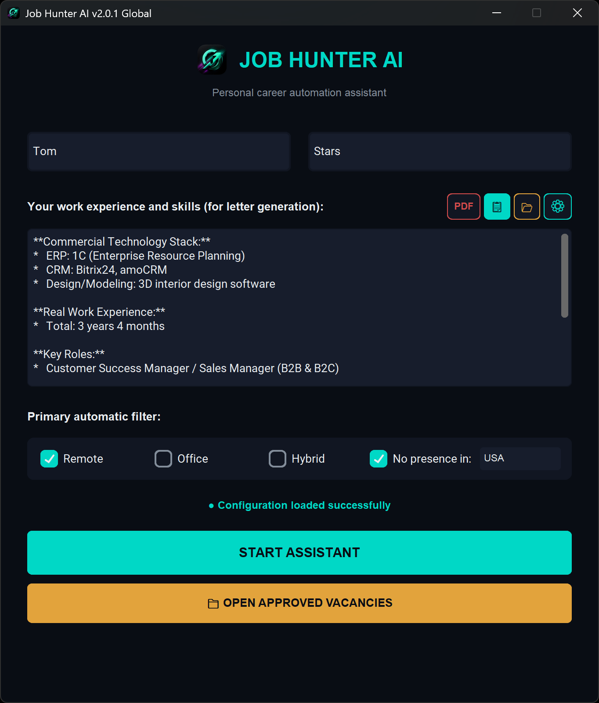
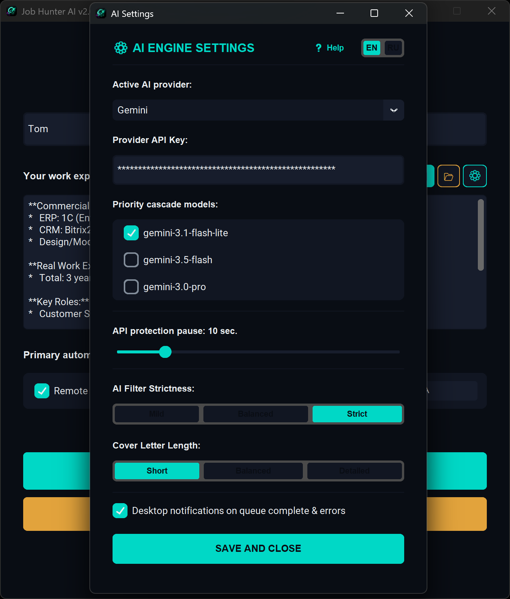
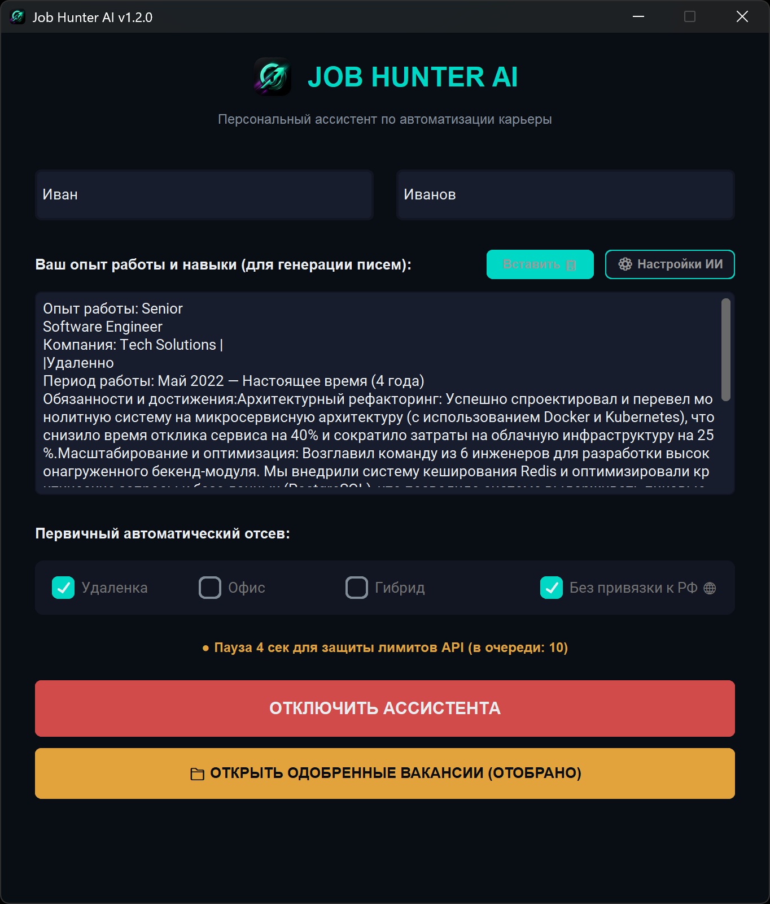
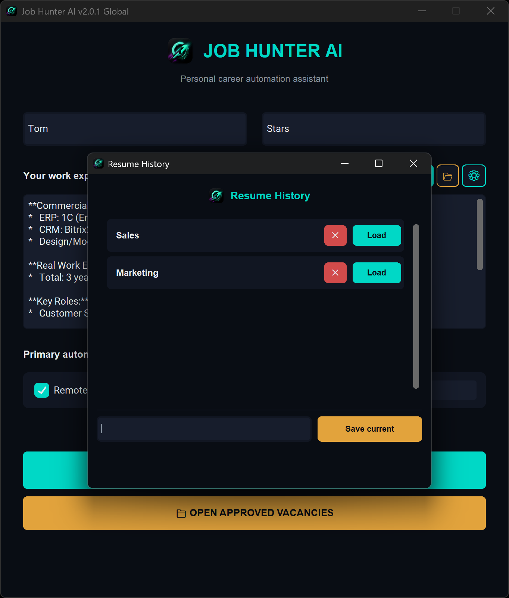
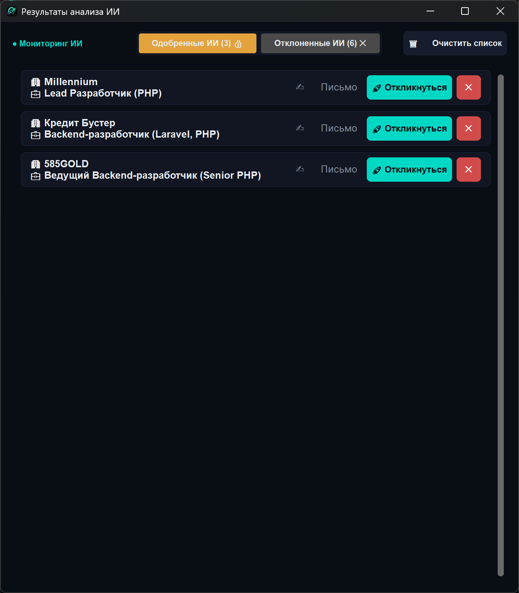

  
  &nbsp;
  

  

<h1 align="center">Job Hunter AI</h1>

  <strong>Your personal AI recruiter, working for you 24/7</strong>

  
  
  
  

---

**Job Hunter AI** is not just a script. It's a full-featured AI assistant that analyzes job listings directly in your browser, ruthlessly filters out garbage, and writes targeted cover letters — while you focus on actually preparing for interviews.

 

<table width="100%">
  <tr>
    <td width="60%" valign="top">
      <h3>⚡ Why this will change your routine</h3>
      <ul>
        <li>💰 <b>100% Free</b> — runs on your own API keys, including the free Gemini tier</li>
        <li>🛡️ <b>Hard filter — up to 60%</b> — scam, MLM, 60h/week slavery, and info-business don't get through</li>
        <li>✍️ <b>Cover letter in seconds</b> — a personalized response matched to the exact job requirements</li>
        <li>🌐 <b>Cloud or your PC</b> — Gemini, GPT-5, Claude 4 <i>or</i> locally via Ollama / LM Studio</li>
        <li>🔒 <b>Full privacy</b> — with local AI, your data never leaves your machine</li>
        <li>🌍 <b>EN / RU</b> — fully localized interface, language persists between sessions</li>
      </ul>
    </td>
    <td width="40%" align="center" valign="middle">
      
    </td>
  </tr>
</table>

 

## ⚙️ Quick Start

Install the desktop application and the Chrome extension. Full step-by-step guide:

<b>✨ Full feature breakdown</b>

 

<table width="100%">
  <tr>
    <td width="60%" valign="top">
      <b>🧠 Multi-engine AI cascade with Failover</b> 
      Automatic switching between Gemini 3.5, GPT-5, Claude 4, DeepSeek, and local models. If the primary provider is unavailable — the next one takes over without dropping the task.
        
      <b>🏠 Local AI — no internet, no API keys</b> 
      Native HTTP integration with Ollama and LM Studio. A background probe monitors server availability and reflects status in the UI (neon cyan / muted red). <code>LOCAL_SAFE_PARAMS</code> compensate for artifacts in quantized 4-bit models.
    </td>
    <td width="40%" align="center" valign="middle">
      
    </td>
  </tr>

  <tr>
    <td width="60%" valign="top">
      <b>🛡️ Two-stage AI analysis</b> 
      <b>Stage 1 — Filter:</b> Detects scam, MLM, toxic work conditions (>45h/week, uncompensated night shifts, info-business, mass hiring). Plus geographic compliance — filters out offers that prohibit remote work from your country. 
      <b>Stage 2 — Cover letter:</b> Only for approved listings. A targeted response addressing the employer's real pain points — no filler, no templates.
        
      <b>🔧 5-level JSON repair pipeline</b> 
      The parser automatically recovers malformed LLM responses: strips Markdown wrappers, cleans trailing commas, fixes boolean literals and broken quotes. No result is ever lost due to model formatting quirks.
    </td>
    <td width="40%" align="center" valign="middle">
      
    </td>
  </tr>

  <tr>
    <td width="60%" valign="top">
      <b>📄 Resume history and PDF import</b> 
      The 📂 button in the main window lets you save multiple resume versions and switch between them in one click. Direct PDF import with AI text extraction is supported.
        
      <b>🔔 Telegram-style toast notifications</b> 
      No system dialogs. Animated notifications slide in from the bottom of the screen, respect the Windows taskbar height, and never block the interface. Left color bar: neon cyan for success, bright red for alerts. Audio plays in a dedicated thread.
    </td>
    <td width="40%" align="center" valign="middle">
      
    </td>
  </tr>

  <tr>
    <td width="60%" valign="top">
      <b>🌍 Full localization (EN / RU)</b> 
      Language is switched in settings and saved to <code>config.json</code>. The entire interface — buttons, messages, errors, counters — passes through a single <code>jh_i18n.py</code> module with named variable substitution.
        
      <b>⚡ Flicker-free smart UI</b> 
      Child windows open at alpha=0.0, compute their coordinates for the current DPI, and appear only after the frame is fully rendered — no position jumps, no flickering. The vacancy list updates incrementally: only changed cards are re-rendered. Dark title bar and icon are set via Win32 API.
    </td>
    <td width="40%" align="center" valign="middle">
      
    </td>
  </tr>
</table>

 

---

🗺️ Architecture diagram (How it works under the hood)

 
<pre>
 ┌────────────────────────────────────────┐
 │            CHROME BROWSER              │
 │  (User clicks in the extension)        │
 └───────────────────┬────────────────────┘
                     │ HTTP POST ( vacancy_data )
                     ▼
 ┌────────────────────────────────────────┐
 │          LOCAL FLASK API               │  [main_app.py]
 │ (Kills zombie processes on port 5000)  │  jh_version.py → build metadata
 └───────────────────┬────────────────────┘
                     │ Enqueues task (.put)
                     ▼
 ┌────────────────────────────────────────┐
 │        THREAD-SAFE QUEUE               │  [queue.Queue]
 │   15s Timer | Rate Limit Guard         │  Countdown status bar
 └───────────────────┬────────────────────┘
                     │ Background thread → task
                     ▼
 ┌────────────────────────────────────────┐
 │        MULTI-ENGINE AI CASCADE         │  [src/jh_ai_engine.py]
 │  Gemini 3.5 ➔ GPT-5 ➔ Claude 4 ➔      │  Failover Chain
 │  DeepSeek ➔ Ollama ➔ LM Studio        │  5-level JSON repair
 │                                        │  Exception hierarchy
 └──────────┬─────────────────┬───────────┘  LOCAL_SAFE_PARAMS
            │                 │
    ┌───────▼───────┐  ┌──────▼──────────┐
    │    STAGE 1    │  │    STAGE 2      │
    │  Hard filter  │  │  Cover letter   │
    │   (up to 60%) │  │  generation     │
    │ Toxic cond.   │  │  (approved only)│
    │ Geo-compliance│  └──────┬──────────┘
    └──────┬────────┘         │
           │ REJECTED         │ APPROVED
           └────────┬─────────┘
                    ▼
 ┌────────────────────────────────────────┐
 │          JH STORAGE MANAGER            │  [src/jh_storage_manager.py]
 │    AppData/Roaming/Job Hunter AI/      │  Resume history | PDF import
 └───────────────────┬────────────────────┘  Log: max 50 entries
                     ▼
 ┌────────────────────────────────────────┐
 │          JH UI + NOTIFICATIONS         │  [src/jh_results_ui.py]
 │  Signature cache | HiDPI | Dark Win32  │  [src/jh_notifications.py]
 │  Hotkeys (RU/EN keyboard layouts)      │  Toast animations | Audio thread
 └─────────────────┬──────────────────────┘
                   │
        ┌──────────▼──────────┐
        │   jh_i18n.py (EN/RU)│  Declarative localization
        └─────────────────────┘
</pre>

---

<b>🛠️ Tech Stack</b>

 

| Layer | Tools |
|---|---|
| **GUI & OS** | `customtkinter` · `Pillow` · `ctypes` Win32 API — dark title bar, `WM_SETICON`, DPI Awareness, cross-layout hotkeys |
| **Localization** | `jh_i18n.py` — declarative EN/RU system with named variable substitution via `tr(key, **kwargs)` |
| **Local API** | `Flask` · `flask-cors` · `threading` · `queue.Queue` — thread-safe webhook receiver from Chrome |
| **AI Cascade** | **Gemini 3.5/3.0** · **GPT-5 / o3** · **Claude 4** · **DeepSeek** (chat / reasoner) · **Ollama** · **LM Studio** |
| **Resilience** | Failover Chain · Exponential Backoff · 5-level JSON parser · Exception hierarchy (`AINetworkError`, `AILocalServerError`, `AITimeoutError`, `AIAuthError`, `AIRateLimitError`) |
| **Local AI** | HTTP integration Ollama / LM Studio · `LOCAL_SAFE_PARAMS` · `MIN_TOKENS_PER_SEC` metric · Async status probe |
| **Notifications** | `jh_notifications.py` — custom Toast with slide/fade animation, color coding, and audio in a dedicated thread |
| **Storage** | JSON in `%APPDATA%` · Resume history · PDF import with AI text extraction · Auto-cleanup logs (50 entry limit) |
| **Build** | `PyInstaller` · `jh_version.py` (single version source → window titles + VERSIONINFO .exe) · `Self-Healing Refactor` in `build_exe.py` |

---

## 🚀 Changelog

<b>📦 v2.0.1 — Major Update (Current)</b>

* **[Architecture]** Global refactor with `jh_` prefix, unified `jh_version.py` module, Self-Healing build via `build_exe.py`.
* **[i18n]** Full interface localization (EN / RU) via `jh_i18n.py` with dynamic switching.
* **[Engine]** Custom exception hierarchy for precise UI responses to network failures, timeouts, rate limits, and parse errors.
* **[Engine]** 5-level cascading repair for malformed LLM JSON responses.
* **[Engine]** Native integration with Ollama and LM Studio: safe generation parameters, speed monitoring, failover between local models.
* **[Engine]** New filters: toxic work condition detection and geographic compliance.
* **[UI]** Resume history 📂 with direct PDF import and AI text extraction.
* **[UI]** Expanded model pool: Gemini 3.5/3.0, GPT-5, Claude 4, DeepSeek (chat/reasoner).
* **[UI]** Async local server status indicator.
* **[UI]** Smooth HiDPI window centering without flickering or micro-jumps.
* **[UI]** Dark title bar and window icon via Win32 API.
* **[UI]** Card signature caching — only changed cards are re-rendered.
* **[Notifications]** Custom Toast notifications: animation, audio, color coding.

<b>📦 v1.2.0</b>

* **[Engine]** Multi-model `BaseProvider` architecture (Gemini, OpenAI, Anthropic, DeepSeek).
* **[Engine]** Failover Chain and automatic JSON repair.
* **[UI]** Dark CustomTkinter interface with full High-DPI support.
* **[UI]** Removed `grab_set()`, incremental list rendering.
* **[API]** Queue timeout manager (15s) with status bar.
* **[API]** Zombie-process killer on port 5000.
* **[Build]** `src/` structure, self-healing build module.

<b>📦 v1.1.0</b>

* **[UI]** Quick-apply buttons ("Apply") in vacancy cards.
* **[UI]** Fixed `Ctrl+V`, `Ctrl+C`, `Ctrl+A` hotkeys on Russian keyboard layout.
* **[UI]** Smooth scrolling without graphical artifacts.
* **[UI]** Auto-reset scroll position when switching filters.

---

## 🗺️ Roadmap

<b>🟢 v1.1.0 — UI & Keyboard Layout (Done)</b>

- [x] UI optimization, scroll fix, hotkeys for Russian keyboard layout.

<b>🟢 v1.2.0 — Multi-Provider (Done)</b>

- [x] Modular engine, Failover Chain, cascading JSON parser, AI control panel.

<b>🟢 v2.0.1 — Full Overhaul (Done)</b>

- [x] Local AI via Ollama / LM Studio without API keys.
- [x] Full EN/RU interface localization.
- [x] Resume history and PDF import with AI text extraction.
- [x] Toast notifications with animation and audio.
- [x] HiDPI centering without flickering, dark Win32 title bar.
- [x] Toxic condition detection and geographic filter.
- [x] Self-Healing build, `jh_version.py`, refactor with `jh_` prefix.

---

## 🤝 Support the project

The project has reached its goals and is in a **stable state**.

If something breaks — open an Issue on GitHub, critical bugs will be fixed.

If the app helped you land a job — leave a star. It's free, and that's how good tools find the people who need them.

  

---

  Made for people who value their time · Non-Commercial · v2.0.1

